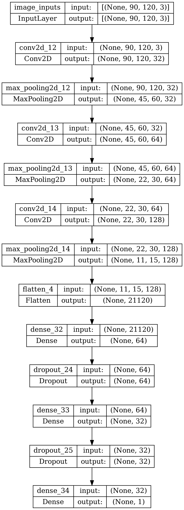
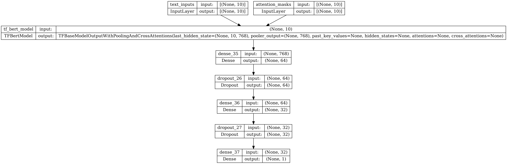

# ML YT Model
This model will take a YT video's thumbnail and title as an input and return it's performance in some metric as its output.

## Setup
Run this command to install all the required dependancies.
```
pip install -r requirements.txt
```
Then make a `.env` file in the same directory with one variable.
```
APIKEY=your-api-key-here
```
Then, simply open `model.ipynb` and go through the steps for model setup.

## Models
There are three models that are tested for this project. There is the image-only model, the text-only model, and the united model. The united model merges both image and text models into a single model. This is to test their effectiveness separately and together. See below for an in-depth layout of their design.






## Additional Information
All main scripts have and will be integrated into a single Juypter Notebook file. All the old scripts and code snippets have been placed in the `deprecated` folder.